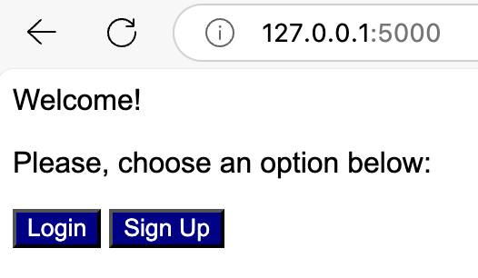
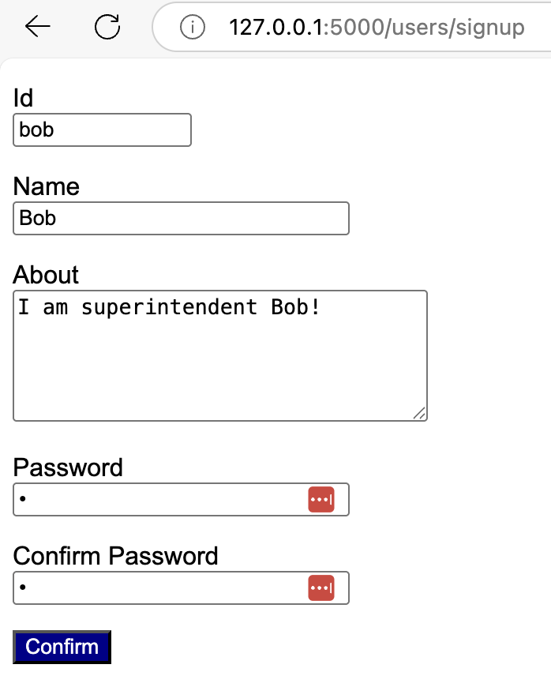
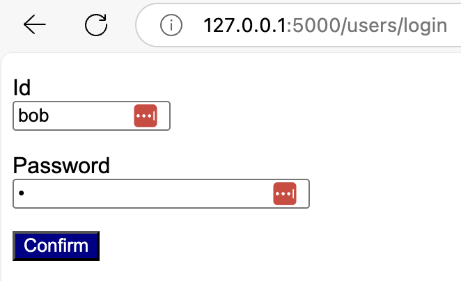
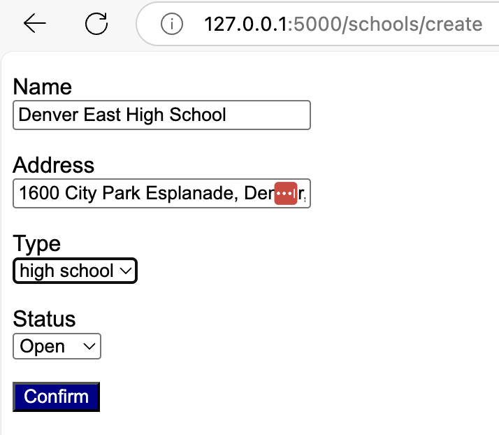
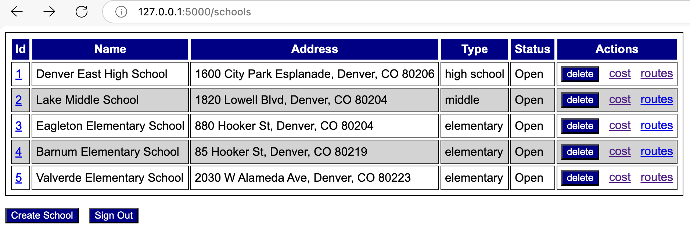
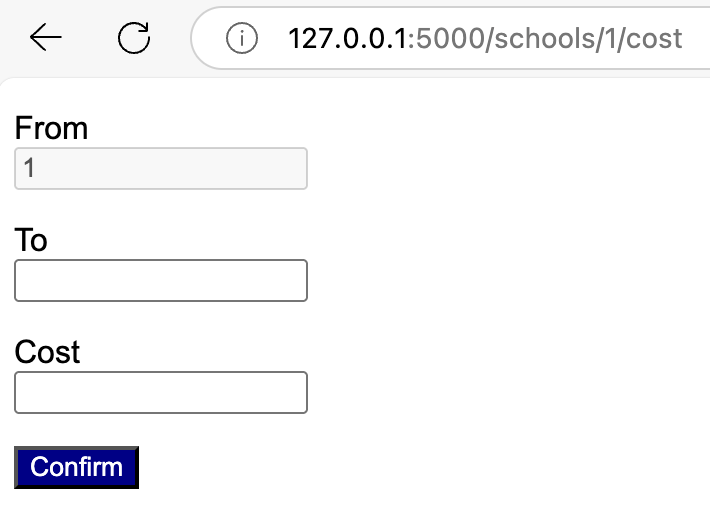
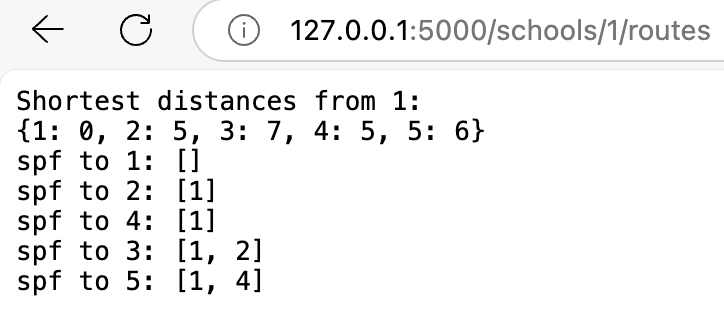

# Overview

Your team has been hired to develop a web application for a small school district to manage its educational resources. The district oversees multiple schools and wants a centralized system to track school facilities, staff assignments, and inter-school resource sharing. Given the well-defined requirements and limited scope, your team has chosen the waterfall process model for this project.

The project follows the traditional phases of the waterfall development model, which include:

* Communication: gathering and understanding requirements
* Planning: defining schedules, resources, and milestones
* Modeling: designing system architecture and data models
* Construction: implementing and testing the application
* Deployment: delivering the final product to users

# Communication Phase

## Overview

The project involves developing a web application to manage information about schools within the district. This includes details such as school name, location, type (elementary, middle, or high school), and operational status (open or closed). 

Additionally, the application will track the cost of transfering shared resources (e.g., laptops, lab equipment, books) between schools. By minimizing transfer costs, the application will help the district reduce overall expenditures and improve operational efficiency.

## Objectives 

* Manage school facility information.
* Track and update shared resource availability (planned).
* Calculate optimal resource distribution between schools.

## Requirements 

1. Users must be able to authenticate themselves.
2. Users should be able to list all schools.
3. Users should be able to create, update, and delete school records.
4. Users should be able to update the availability and transfer status of shared resources (planned).
5. Users should be able to retrieve optimal resource distribution plans between schools.

## Constraints 

* A working version of the web application is expected to be delivered in 3 weeks. 
* The implementation team is limited to 3 members. 
* The software must be implemented in Python, Flask, and SQLAlchemy. 

## Risks 

* The tight schedule may result in the system not meeting quality requirements. 

# Planning Phase

## Schedule 

Estimate a schedule for this project by completing the table below. 

|Phase|Task|Start|End|Duration|Deliverable|
|---|---|---|---|---|---|
|Modeling|Requirements Analysis|mm/dd/26|mm/dd/26|1 day|Use Case Diagram|
|Modeling|Data Model|mm/dd/26|mm/dd/26|1 day|Class Diagram|
|Construction|Coding|mm/dd/26|mm/dd/26|11 days|Code|
|Construction|Testing|mm/dd/26|mm/dd/26|6 days|Test Report|
|Deployment|Delivery|mm/dd/26|mm/dd/26|2 days|Final Commit/Push|

## Team Roles

Assign roles to each team member by completing the table below. A member may take on more than one role.

|Name|Role(s):manager,developer,tester,documenter|
|--|--|
|Juvia Archuleta|Roles: Planner|
|Leigha Lennon|Roles: Planner, Modeler|

# Modeling Phase

## Requirements Analysis 

Based on the project description, perform a requirements analysis by developing a UML use case diagram that captures the system's key functionalities and user interactions.

## Data Model 

Based on the data model defined in [src/models.py](src/models.py), create a UML class diagram to document the system's structure. The model includes the following entities:

* User: id, name, about, and password.
* School: id, name, address, type (elementary, middle, high), and status (open or closed).
* TransporationCost: from_school, to_school, cost. 

Make sure that your class diagram shows the association between **School** and **TransportationCost**, representing the cost of transfering resources between schools.

## Baseline Implementation

A baseline for the web app is given in **Flask**. The project should be structured like the following: 

```
.venv
pics
src
|__app
|____ __init__.py
|____ modes.py
|____ routes.py
|____ forms.py
instance
|__ schools.db
static
|__ style.css
templates
|__ base.html
|__ index.html
uml
|__ class.wsd
|__ use_case.wsd
README.md
requirements.txt
Dockerfile
```

[.venv](.venv) should not be pushed to the remote repository. Be sure to add it to your [.gitignore](.gitignore) file to exclude it from version control.

# Implementation Phase

Following software development collaboration best practices, create a **dev** branch to manage beta versions of your project. Additionally, each team member should create local temporary branches for individual development and testing tasks. Once the **dev** branch reaches a stable state, merge it into the **main** branch. The **main** branch should be protected. 

The template code includes suggested API routes that follow industry best practices. We strongly recommend adopting these routes to ensure consistency and maintainability.

To compute the shortest paths for resource transfers between schools, we recommend using the library developed in Homework #4.

Before beginning implementation, a team representative must meet with the instructor for a **mandatory** checkpoint. This can be done eiter in person or online. Either way, it needs to be scheduled. Be prepared to present the following:

* Use case and class diagrams
* A working baseline implementation of the app
* The **main** branch is protected
* A draft project schedule
* Team role assignments

# Testing Phase

At this stage, you are not expected to write automated tests. Instead, you should perform manual testing, documenting your test results using the table provided below.

|Functionality Tested|Date|Time|Result|
|--|--|--|--|
|Sign Up|99/99/26|99:99|passed|
|...|...|...|...|

# Deployment Phase

Commit and push your project using "final submission" as the commit message. Additionally, create a Docker image to allow the instructor to run your project in a containerized environment. To meet this requirement, include a **Dockerfile** in your repository that enables the instructor to build the image and run the application as a container.

# Team Evaluation 

Please reflect on both your own contributions and those of your teammates using the descriptions provided for each dimension. You may refer back to these descriptions as you consider each person's role in the project.

* Meaningful Contributions: Consider how often and significantly the person contributed to the project. This includes writing code, testing, researching, documenting, or helping solve problems.
* Value of Contributions: Value goes beyond technical input. It includes contributions in organization, communication, conflict resolution, and other areas that support team success.
* Collaboration: Collaboration ranges from baseline participation-such as responding when asked-to proactive support like initiating discussions and resolving misunderstandings. Collaboration: can range from basic participation—such as responding when asked—to proactive engagement, like initiating discussions and helping resolve misunderstandings.
* Initiative and Responsibility: Initiative means stepping up without needing to be asked. Responsibility includes owning tasks, meeting deadlines, and following through on commitments.
* Communication and Dependability: This includes keeping teammates informed, communicating challenges, and reliably completing assigned tasks.
* Presence and Availability: Reflect on how consistently the person was present and reachable—attending meetings, responding to messages, and participating in team activities. Note that some team members may contribute meaningfully but be less available than expected.
* Trust Building: Trust is essential for team success because it creates the foundation for effective collaboration, communication, and accountability. When team members trust each other, they feel safe sharing ideas, asking questions, and giving honest feedback—without fear of judgment or retaliation.
* Conflict Resolution: Conflict resolution is the process of addressing and resolving disagreements in a constructive and respectful way. It helps team members find common ground, maintain collaboration, and move forward productively.
* Decision-Making: Decision-making is the process of choosing the best course of action among available options to achieve a goal. It provides direction and keeps the team moving forward.

```
Your Name: <Last_First_Name>
```

Rate your collaboration using: 
* 1 (strongly disagree)
* 2 (disagree)
* 3 (neutral)
* 4 (agree) or 
* 5 (strongly agree)

```
[  ] I made meaningful contributions to the project.
[  ] My contributions were valuable to the team’s success.
[  ] I supported collaboration within the team.
[  ] I took initiative and responsibility for my work.
[  ] I communicated effectively and was dependable.
[  ] I was present and available to the team as expected.
[  ] I fostered trust by being reliable, transparent, and respectful in all interactions.
[  ] I helped resolve disagreements constructively, promoting understanding and collaboration.
[  ] I contributed to or led decision-making processes with clarity, fairness, and consideration of team input.
```

```
Teamate's Name: <Last_First_Name>
```

Rate their collaboration using: 
* 1 (strongly disagree)
* 2 (disagree)
* 3 (neutral)
* 4 (agree) or 
* 5 (strongly agree)

```
[  ] The team member made meaningful contributions to the project.
[  ] The team member  contributions were valuable to the team’s success.
[  ] The team member supported collaboration within the team.
[  ] The team member took initiative and responsibility for my work.
[  ] The team member communicated effectively and was dependable.
[  ] The team member was present and available to the team as expected.
[  ] The team member fostered trust by being reliable, transparent, and respectful in all interactions.
[  ] The team member helped resolve disagreements constructively, promoting understanding and collaboration.
[  ] The team member contributed to or led decision-making processes with clarity, fairness, and consideration of team input.
```

```
Teammate's Name: <Last_First_Name>
```

Rate their collaboration using: 
* 1 (strongly disagree)
* 2 (disagree)
* 3 (neutral)
* 4 (agree) or 
* 5 (strongly agree)

```
[  ] The team member made meaningful contributions to the project.
[  ] The team member  contributions were valuable to the team’s success.
[  ] The team member supported collaboration within the team.
[  ] The team member took initiative and responsibility for my work.
[  ] The team member communicated effectively and was dependable.
[  ] The team member was present and available to the team as expected.
[  ] The team member fostered trust by being reliable, transparent, and respectful in all interactions.
[  ] The team member helped resolve disagreements constructively, promoting understanding and collaboration.
[  ] The team member contributed to or led decision-making processes with clarity, fairness, and consideration of team input.
```

# Submission

Only one member of the team needs to submit the ```.bundle``` repository file. The others are only required to submit this README.md file (because of the team evaluation section). 

All of the source files must have the names of all of the teammates. 

# Rubric 

```
+5 Planning: Schedule
+5 Planning: Team Roles 
+10 Modeling: Use Case Diagram 
+10 Modeling: Class Diagram
+10 Check-point
+40 Implementation
+10 Testing 
+10 Deployment
-25 Team/Self Evaluation
-5 main branch not protected
```

## Bonus

+5 incorporating a visual representation of the facilities and the transportation costs between them using a graph library.

# User Interface Suggestions














